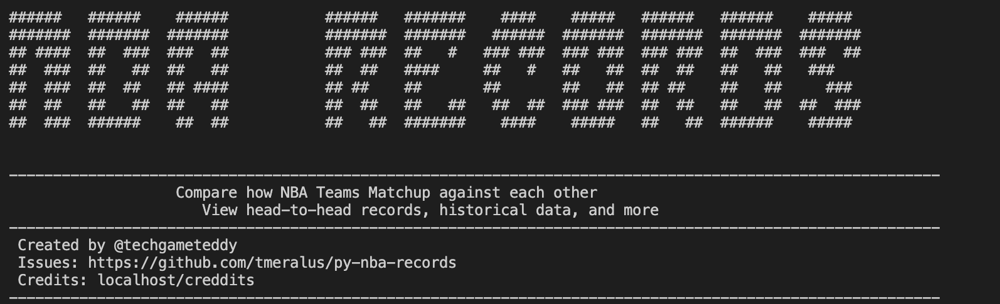

# py-nba-historian

The py-nba-historian is a terminal based tool for 
matching up head to head team scores. 

#### A few features are 
- Head-to-Head All Time Record 
- Team Summary and Stats 

#### Coming Soon
- Game Logs 

